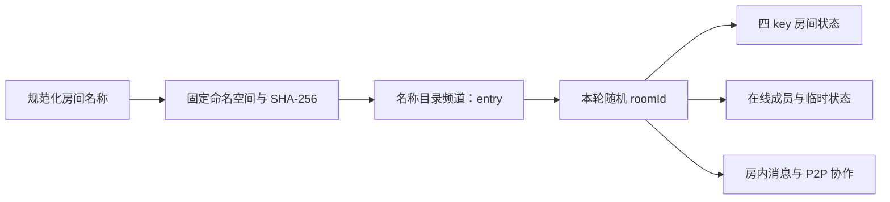

# 按名称加入与共享目录

新建房间在同一个 App ID 的语聊房命名空间内名称唯一。听众输入名称即可加入，跨设备不需要复制 Local Storage。旧版邀请仍可使用，旧房间不自动迁移到共享目录。

## 交互与状态

首页保留左右两个主入口：填写房间名称创建房间、填写房间名称加入房间；两边均可选填自己的昵称。页面不再提供邀请链接输入和提交入口；已有完整房间 URL 仍兼容直接打开。已移除“本机最近房间”列表，名称房间不再写入本机历史记录；房内不再提供“邀请好友”按钮。

名称支持 1–32 个 Unicode 字符。创建与加入统一执行 NFKC、去首尾空格、合并连续空格和 ASCII 小写转换；不接受控制字符与不可见格式字符。实际显示保留规范化后的英文大小写。名称登记后不提供改名。

昵称使用独立规则：NFC 规范化、去首尾空白，最多 20 个 Unicode 码点；保留内部空格、大小写和全半角，支持中文与 Emoji，拒绝换行/控制字符和只有不可见字符的内容。空白昵称使用角色默认值（Host 或按 UID 生成的英文听众昵称）。允许重名，所有治理操作仍按 UID 执行；昵称不写入名称目录、不参与房间查找或身份判断。

查找、占名、准备实际房间、加入期间禁用重复提交，支持取消。空快照才表示没有登记；网络错误和超时显示待确认，不自动创建。输入已占用的名称创建时提示改用听众加入入口。

## 两个频道，一个客户端

名称频道名为 `vrn-v1-` 加 SHA-256 的 Base64URL，共 50 个 ASCII 字符。哈希输入固定为 `voice-room:v1:` 加规范名称。RTM App ID 自然隔离不同项目。

- 名称目录只订阅 Metadata，Message、Presence、Lock 均关闭。
- 实际房间继续订阅 Message、Presence、Metadata，Lock 关闭。
- 同一 `AppRtmSession` 提供两个端口；按频道的目录 observer 与当前角色 listener 共存。
- 不新增第二个 RTM client，不调用 `getChannelMetadata()`、Presence 查询或 Lock。
- `host/name-directory-rtm.ts` 承担登记、开放、解散和封禁写入；Audience 适配器只有只读订阅。

实际房间 Storage 仍只有 `hostUserId`、`announcement`、`seats`、`forcedMutedUserIds`。目录的 `entry` 是独立频道中的 JSON，包含 `schemaVersion`、`canonicalName`、`roomName`、`roomId`、`hostUserId`、`status`、`attemptId`、`createdAt`、可选 `endedAt` 和 `banUserIds`。

## 创建与恢复

1. 先订阅目录并收到有效快照。空记录以 `majorRevision=0` 占用；inactive 记录使用对应正版本条件替换。
2. 写入 creating，并持久保留此次请求的 attemptId 与候选 roomId。URL 保留页面身份，Session Storage 帮助中断恢复。
3. 订阅实际随机房间，由 Host 在空快照上初始化四个 key。
4. 等待 `waitUntilReady()`，确认实际房间 Host 与目录一致；再次检查本轮 attemptId、roomId、Host 和状态，然后条件提交 active。
5. active 确认后撤掉交互蒙层并启动 RTC / Presence。

SDK subscribe 返回不等于业务就绪。初始化失败保留 creating 供同一请求恢复，不能显示创建成功。请求成功但应答丢失时重新订阅取得新快照，通过 attemptId 与结果状态确认，不进行无版本覆盖。

其他创建者需要持续在线观察同一个 creating 记录至少 60 秒，重新取快照且版本仍匹配时才能接管。记录变化或断线重新计时。接管生成新的随机实际房间，旧请求后续提交无法通过版本和归属校验。active 不因 Host 缺席而自动过期。

## 加入与生命周期

名称解析得到当前本轮 roomId，检查状态、Host、封禁后才创建 Audience 角色。订阅实际房间并收到匹配的权威状态，再确认目录仍 active 才完成入房。入房之后继续观察共享记录；断线时遮罩提示确认中，SDK 后续快照恢复权威状态。

Host 暂时离开只退订，不清除名称。Host URL 恢复时，本页 UID 必须与云端 Host UID 一致。输入房间名称始终以听众加入，不能取得房主身份。

Host 解散必须先确认共享 inactive，再广播 `room.dissolved` 并离开。广播失败仍可由目录更新或重连快照让其他端退出。共享写入失败或状态无法确认时，不把本地房间假装置为已解散。

封禁先将 UID 条件写入共享 `banUserIds`，再清理麦位并发 P2P；相同 UID 即使清理本地最近记录，仍会被共享准入拒绝。Demo 的 UID、Host 和权限依然由客户端协作，不构成账号认证或服务端强制权限。

## 邀请与旧房间

V2 payload 为 `{ version: 2, nameKey, roomId, role, pageUid, nickname }`，仍只使用一个 `data` 参数。分享给听众时 pageUid 与 nickname 为空，入房后写回本页身份。

Host 从创建阶段第一次写 URL 起即保存本次规范昵称，creating/active 恢复均沿用；Audience 入房后将最终昵称和页面 UID 一同写回。有效 URL 刷新保持 UID 和昵称，旧 null/缺字段昵称继续使用默认值，pageUid=null 但 nickname 有效时仅新建 UID、不覆盖昵称。URL 中非空昵称必须通过通用昵称校验；非法 payload 不自动加入原房间，页面沿现有行为返回普通入口。新版本兼容旧生成链接，旧部署的英文限定校验可能拒绝含自定义昵称的新链接。

同名重建永远生成新 roomId。旧邀请和旧最近记录先校验原 roomId，不能自动跳进同名新房间；旧 Host 的迟到操作也不能修改新一轮记录。重建不继承上一轮封禁名单。

V1 payload 保留本地目录快照解析和原生命周期，不自动获得名称发现、共享封禁或共享解散能力。旧邀请兼容数据沿用本地清理规则，这与共享房间存活时间无关。

## 数据流与验证

目录 API / Storage 事件以“名称目录”摘要进入单独的 trace source，仍归属 Host 或 Audience。来源具有独立展示标识，避免同一 UID 多次入房或目录与房间的序号重复。离房后数据流保留，清空按钮才显式清理。体验路径只消费实际房间的成功证据，目录查询不推进“入房完成”。

新增共享云端替身测试使用独立页面会话与独立本地存储，覆盖并发、取消、初始化失败、未知写入结果、封禁、解散与旧邀请。浏览器 E2E 使用假项目和离线 SDK adapter，只验证交互和布局。真实云端验证另行运行，不把离线测试当作跨设备连通证明。

名称哈希使用 Web Crypto。部署应使用 HTTPS；本机 localhost 也可使用。局域网其他设备需访问同一版本体验馆与相同 App ID；真实麦克风的 HTTPS 与设备授权要求沿用项目原有说明。

## 解散后的入口

房主主动解散确认后直接返回创建／加入入口，并移除 URL 中的旧房间参数，保留页面 RTM 登录与累计数据流。共享写入未确认时留在房内提示错误；共享解散已确认但广播失败时仍可返回入口。其他成员收到解散通知后保留结束原因提示。

解散将名称目录 `entry.status` 更新为 `inactive` 并记录 `endedAt`，保留该目录记录；Host 广播结束后调用 `storage.removeChannelMetadata` 清理本轮实际房间的 `hostUserId`、`announcement`、`seats`、`forcedMutedUserIds`。先阻止本端新写入并等待在途写入完成，避免清理后又被本端写回。广播失败仍执行清理；删除失败在入口提供重试，重试固定原 roomId。同名重建使用新的随机 roomId。页面关闭前未完成的清理不能保证由纯前端自动补偿。
