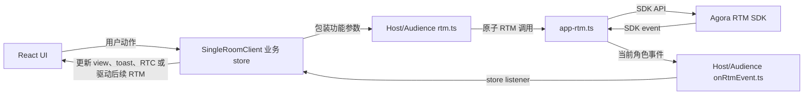
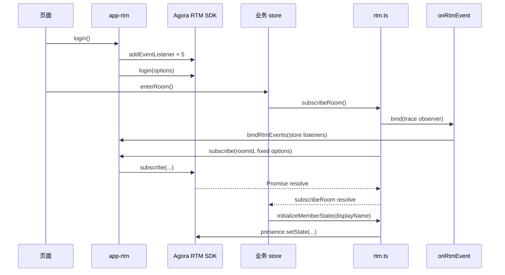
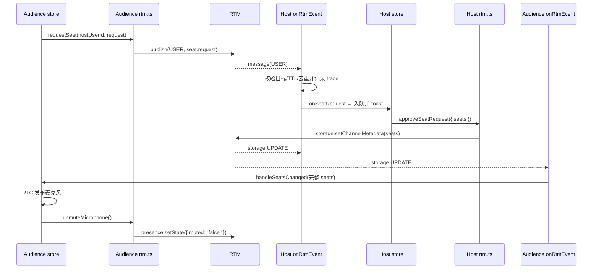
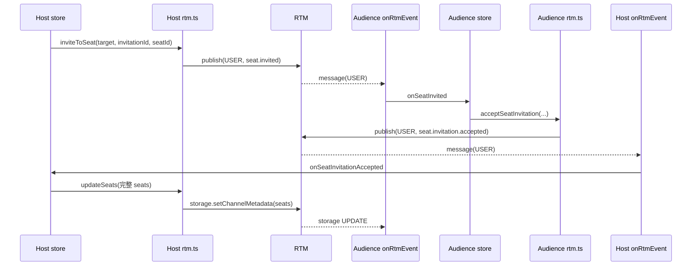
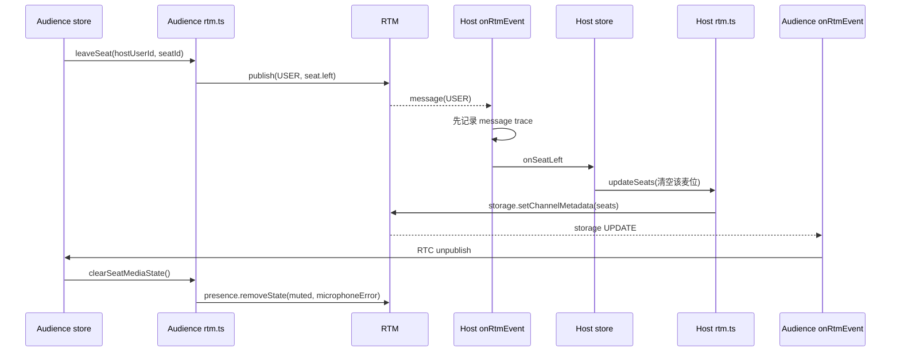
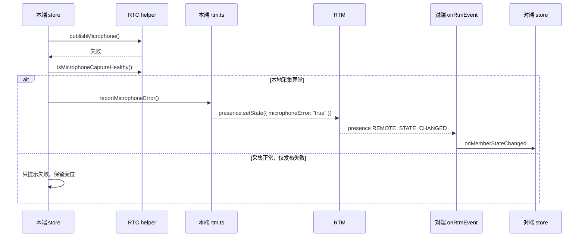
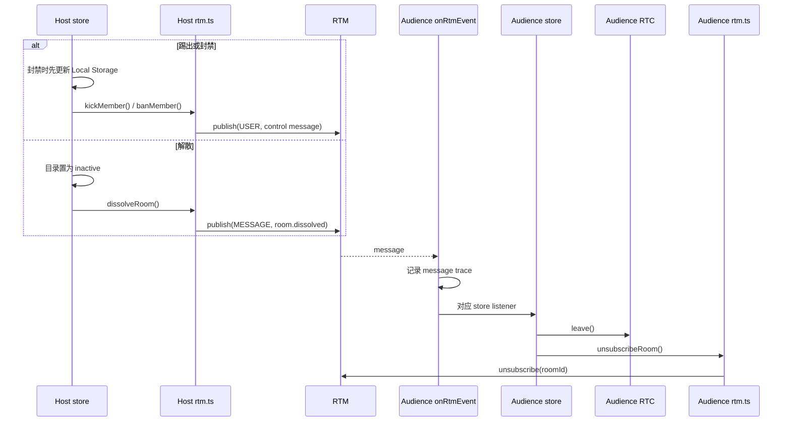

# 语聊房功能、底层 RTM API、事件与时序

更新日期：2026-08-20

本文描述当前单角色语聊房运行路径中，业务功能如何落到 Host/Audience `rtm.ts`、`app-rtm.ts` 和 Agora RTM SDK，以及 SDK 事件如何经各端 `onRtmEvent.ts` 回到业务 store。

第一次阅读建议先从[《语聊房中的 RTM 使用》](../README.md)开始。该 README 说明单页应用的整体目标、模块职责和推荐源码顺序；本文继续展开逐功能的 RTM API、事件与时序。

> 本文按当前 Demo 实现描述完整链路。Demo 没有 App Server，因此使用 Local Storage 代替房间目录、准入和封禁服务，并把 nickname 临时写入 Presence State。生产环境应由 App UID 作为业务用户唯一主键，在同一用户记录中关联 nickname、avatar 和唯一 RTM UID；收到 RTM 事件后通过 publisher RTM UID 反查 App UID 与用户资料。Presence 只承载在线临时状态。详见场景 README 的“Demo 中由浏览器代替 App Server 的部分”。

## 1. 模块职责

| 模块 | 负责 | 不负责 |
| --- | --- | --- |
| `app-rtm.ts` | 与单页面应用生命周期对齐的唯一 client、登录前注册五类 SDK listener、login/logout、原始 RTM 操作端口、当前角色事件切换 | 房间协议、信封、麦位、昵称、toast、RTC |
| Host/Audience `rtm.ts` | 语义化原子函数、信封创建、publish、Presence/Storage 写、subscribe/unsubscribe、API trace | SDK 事件类型判断、收信校验、业务状态转移 |
| Host/Audience `onRtmEvent.ts` | 绑定五类事件、房间过滤、P2P 目标校验、TTL、去重、事件 trace、调用 store listener | nickname store、麦位解析、业务判断、RTC |
| `event-driven-single-room-client.ts` | 唯一业务 store、Presence nickname、UID 展示降级、参数组装、事件摘要、状态转移、toast、RTC、Local Storage 协作、驱动后续 RTM 函数 | 直接调用 Agora RTM SDK；把 Storage `seat.displayName` 当作 nickname |

事件入口采用固定顺序：store listener 先返回 `summary` 和延迟执行的 `consume`，`onRtmEvent.ts` 先记录事件 trace，再调用 `consume`。这保证收到 `seat.left` 后，时间线顺序稳定为 `message` → `storage.setChannelMetadata` → `storage UPDATE`。

## 2. 页面级 RTM API 与事件

### 2.1 `AppRtmSession` 到 SDK 的映射

| App RTM 接口 | Agora RTM SDK | 固定参数或约束 |
| --- | --- | --- |
| `login()` | `client.login(options)` | client 配置 `logLevel=debug`、`useStringUserId=true`、`presenceTimeout=5`；五类 listener 必须先注册 |
| `logout()` | `client.logout()` | 只在语聊房 SPA 真正卸载时调用 |
| `subscribe(roomId, options)` | `client.subscribe(roomId, options)` | `withMessage=true`、`withPresence=true`、`withMetadata=true`、`withLock=false` |
| `unsubscribe(roomId)` | `client.unsubscribe(roomId)` | 离房只退订，不 logout |
| `publish(channelName, message, type)` | `client.publish(channelName, message, { channelType: type })` | `type` 仅为 `MESSAGE` 或 `USER` |
| `setPresenceState(roomId, state)` | `client.presence.setState(roomId, "MESSAGE", state)` | 只做增量写 |
| `removePresenceState(roomId, keys)` | `client.presence.removeState(roomId, "MESSAGE", { states: keys })` | Audience 离麦删除媒体状态 |
| `setRoomMetadata(roomId, data, majorRevision?)` | `client.storage.setChannelMetadata(roomId, "MESSAGE", data, options?)` | 只有 Host 使用；不带 Lock |
| `bindRtmEvents(listeners)` | 页面级 listener 的内部分发 | 同一时刻只把事件交给当前角色；旧 cleanup 不能解绑新角色 |

### 2.2 SDK 事件入口

| SDK 事件 | `onRtmEvent.ts` 处理 | store listener |
| --- | --- | --- |
| `linkState` | `app-rtm.ts` 记录页面级事件 trace；`onRtmEvent.ts` 只映射为 `connected/reconnecting/...` | `onLinkState` |
| `presence` | 只接受当前 `roomId` 的 `MESSAGE` 事件 | `onPresence` → `handlePresenceEvent` |
| `storage` | 只接受当前房间、`MESSAGE`、`CHANNEL` 的事件 | `onMetadata` → `handleRoomMetadataChanged` |
| `message` | 校验频道、JSON 信封、`schemaVersion`、房间、目标、TTL、`messageId` 去重 | `onMessage` → `handleMessageEvent` |
| `token` | 记录事件；只有 `WILL_EXPIRE` 报业务错误 | 无独立业务状态 listener |

## 3. 功能到 RTM API/事件的完整映射

### 3.1 房间生命周期与 Presence

| 功能 | 发起端 `rtm.ts` 函数 | 底层 SDK API | 接收事件 | store 消费 |
| --- | --- | --- | --- | --- |
| 订阅房间 | 两端 `subscribeRoom()` | `subscribe` | 后续 `presence/storage/message` | 对应 listener |
| 取消订阅 | 两端 `unsubscribeRoom()` | `unsubscribe` | 无 | store 在 RTC leave 后调用 |
| Host 初始化空房间 | Host `initializeRoom(data, majorRevision)` | `storage.setChannelMetadata` | `storage UPDATE` | `handleRoomMetadataChanged` |
| 初始化成员状态 | 两端 `initializeMemberState(displayName)` | `presence.setState` | `presence REMOTE_STATE_CHANGED` | `onMemberStateChanged` |
| 本端闭麦/开麦 | 两端 `muteMicrophone()` / `unmuteMicrophone()` | `presence.setState({ muted })` | 同上 | `onMemberStateChanged` |
| 报告/清除麦克风异常 | 两端 `reportMicrophoneError()` / `clearMicrophoneError()` | `presence.setState({ microphoneError })` | 同上 | `onMemberStateChanged` |
| Audience 离麦清状态 | `clearSeatMediaState()` | `presence.removeState({ states: ["muted", "microphoneError"] })` | 同上 | `onMemberStateChanged` |

### 3.2 排麦、邀请与麦位

| 功能 | 发起端 `rtm.ts` 函数 | 消息/Storage 内容 | 接收事件 | store 消费与后续动作 |
| --- | --- | --- | --- | --- |
| Audience 申请上麦 | `requestSeat(hostUserId, request)` | P2P `seat.request`；`{ requestId, seatId }` | Host `message USER` | `onSeatRequest` 更新队列并 toast |
| Host 同意申请 | `approveSeatRequest({ seats })` | Storage `seats=完整麦位表` | 两端 `storage UPDATE` | `handleSeatsChanged`；Audience 再发布 RTC |
| Host 拒绝申请 | `rejectSeatRequest(...)` | P2P `seat.rejected` | Audience `message USER` | `onSeatRejected` 清等待态 |
| Host 邀请上麦 | `inviteToSeat(...)` | P2P `seat.invited` | Audience `message USER` | `onSeatInvited` 保存邀请 |
| Audience 接受邀请 | `acceptSeatInvitation(...)` | P2P `seat.invitation.accepted` | Host `message USER` | `onSeatInvitationAccepted` 计算麦位并调用 `updateSeats()` |
| Audience 拒绝邀请 | `rejectSeatInvitation(...)` | P2P `seat.invitation.rejected` | Host `message USER` | `onSeatInvitationRejected` 提示结果 |
| Host 更新麦位 | `updateSeats(seats)` | Storage `seats=完整麦位表` | 两端 `storage UPDATE` | `handleSeatsChanged` 全量替换 |
| Audience 主动下麦 | `leaveSeat(hostUserId, seatId)` | P2P `seat.left` | Host `message USER` | `onSeatLeft` 调用 `updateSeats()`；Audience 随 Storage 事件离麦 |

### 3.3 房间内容与治理

| 功能 | 发起端 `rtm.ts` 函数 | 底层内容 | 接收事件 | store 消费 |
| --- | --- | --- | --- | --- |
| 更新公告 | Host `updateAnnouncement(text)` | Storage `announcement` | `storage UPDATE` | `handleAnnouncementChanged` |
| 更新强制静音名单 | Host `updateForcedMutedUsers(userIds)` | Storage `forcedMutedUserIds` | `storage UPDATE` | `handleForcedMutedUsersChanged` 并收敛 RTC |
| 踢出成员 | Host `kickMember(targetUserId)` | P2P `member.kick` | Audience `message USER` | `onMemberKicked`：RTC leave → unsubscribe |
| 封禁成员 | Host `banMember(targetUserId)` | P2P `member.ban` | Audience `message USER` | `onMemberBanned`：先更新本地目录，再离房 |
| 解散房间 | Host `dissolveRoom()` | 房间消息 `room.dissolved` | Audience `message MESSAGE` | `onRoomDissolved`：目录 inactive → RTC leave → unsubscribe |
| 普通聊天 | 两端 `sendChatMessage(text)` | 房间消息 `chat.message`；`{ value: text }` | `message MESSAGE` | `onChatMessage` |
| 礼物 | 两端 `sendGiftMessage()` | 房间消息 `gift.sent`；`{ value: "🎁" }` | 同上 | `onGiftMessage` |
| 爱心 | 两端 `sendHeartMessage()` | 房间消息 `emoji.reaction`；`{ value: "❤️" }` | 同上 | `onHeartMessage` |

踢出、封禁、强制麦控是客户端协作行为，不是服务端强制权限控制。

## 4. 关键时序图

### 4.1 登录、绑定事件与订阅

### 4.2 Audience 申请上麦，Host 同意

### 4.3 Host 邀请 Audience 上麦

### 4.4 Audience 主动下麦

### 4.5 麦克风异常协作状态

### 4.6 踢出、封禁与解散

## 5. 不变量

- 每个 Tab 只有一个 `AppRtmSession`、一个真实 RTM client 和一个当前角色。
- `rtm.ts` 不 import `RTMEvents`，不包含 `eventHandlers()`、`parseEnvelope()` 或消息去重集合。
- `onRtmEvent.ts` 不维护 nickname、麦位、公告、排麦队列或 RTC 状态。
- 业务 store 不直接 import 或调用 `agora-rtm`。
- nickname 只来自 Presence store；缺失或离线时展示省略后的 UID，不读取 Storage `seat.displayName`。
- Audience 不写 Channel Storage；Host 不使用 Lock，也不主动调用 `getChannelMetadata()`。
- Storage 事件是完整权威状态；Presence `SNAPSHOT` 全量替换，其他事件增量消费。
- 所有消息先通过信封校验和去重，再生成事件 trace 和进入业务消费。
